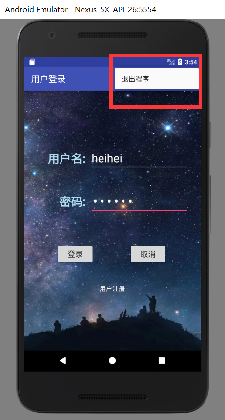

# 安卓应用 登录注册功能实现

*BTW: 这是移动开发实验3...*

- android studio项目

- 使用了litepal数据库

- 需要在build.gradle中添加
```
compile 'org.litepal.android:core:1.4.1'
```

    - 在app/src/main中创建assets文件夹，并创建litepal.xml

# 界面展示





